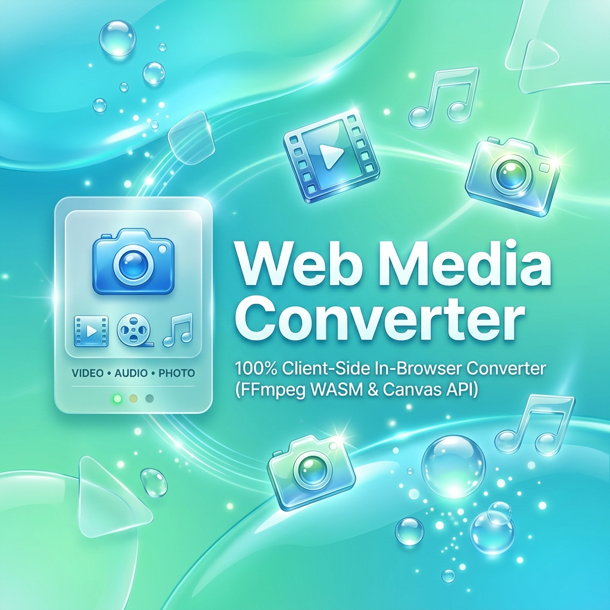

<div align="center">



# 🖼️🎬🎵 Web Media Converter

**All-in-one batch media converter right in your browser — fast, secure, and 100% serverless.**

🌐 **[English Version](README.md)** | **[Русская версия](README.ru.md)**

[](https://github.com/Fuheshka/web-media-converter/actions/workflows/deploy.yml)


<br />

[**🚀 Launch Web App**](https://fuheshka.github.io/web-media-converter/) · [Report Bug](https://github.com/Fuheshka/web-media-converter/issues) · [Request Feature](https://github.com/Fuheshka/web-media-converter/issues)

</div>

<br />

## 📋 About The Project

Web Media Converter is a client-side web application for batch converting image, video, and audio files. All operations are executed **entirely inside your browser** (images via Canvas API, video and audio via FFmpeg compiled to WebAssembly). Your files are never uploaded to any remote server, guaranteeing maximum privacy and speed.

Designed with a sleek **Frutiger Aero** interface (Aero Glass reflections, glossy controls, floating ambient bubbles), full **bilingual support (RU / EN)**, **dark mode**, and **local conversion history tracking**.

<br />

## ✨ Features

<table>
<tr>
<td width="50%">

### 🖼️ Images
- Formats: **JPG · PNG · WebP · AVIF · BMP · GIF · ICO · TIFF**
- Quality control & aspect-ratio-preserving resize
- Automatic background fill for transparent JPEG exports

</td>
<td width="50%">

### 🎬 Video
- Formats: **MP4 · WEBM · AVI · MOV · MKV · GIF**
- Codec choices: H.264, VP9, H.265, or direct stream copy
- Custom resolution scaling (up to 4K) & FPS (24–60)
- Video trimming by start/end timestamps

</td>
</tr>
<tr>
<td width="50%">

### 🎵 Audio
- Formats: **MP3 · WAV · OGG · AAC · FLAC · M4A**
- Bitrate adjustment (96–320 kbps) & sample rates (22–48 kHz)
- Precision audio trimming by seconds

</td>
<td width="50%">

### 🎛️ Batch Processing & UX
- **Drag & Drop** and Clipboard paste (**Ctrl+V**)
- **Bilingual Interface (English & Russian)** with auto-detection
- Multi-threaded parallel image processing (up to 6 workers)
- One-click **ZIP package download**
- **Dark Mode** & automatic file metadata parsing

</td>
</tr>
<tr>
<td colspan="2">

### 📊 History & Analytics
- Built-in **History Drawer** (saved locally in `localStorage`)
- Log of past conversions with individual compression metrics
- Global space savings dashboard counter

</td>
</tr>
</table>

<br />

## 🏗️ Architecture

```
src/
├── types/
│   └── media.ts                # Shared TypeScript interfaces & configuration schemas
├── utils/
│   └── formatHelpers.ts        # Utilities (byte formatting, duration parser, auto-detect)
├── i18n/
│   └── translations.ts         # Bilingual translation dictionary (RU / EN)
├── context/
│   └── LanguageContext.tsx     # Language state provider & useLanguage hook
├── hooks/
│   ├── useMediaConverter.ts    # Main orchestrator (queue pool, worker pool, ZIP exporter)
│   ├── useImageEngine.ts       # Canvas API image conversion pipeline
│   ├── useFFmpegEngine.ts      # FFmpeg WASM audio/video processor
│   └── useConversionHistory.ts # Local Storage history persistence
├── components/
│   ├── Controls.tsx            # Category control panel (Images/Video/Audio)
│   ├── FileList.tsx            # Queue viewer with Aero progress indicators
│   ├── HistoryDrawer.tsx       # Slide-over conversion history drawer
│   ├── LanguageToggle.tsx      # Language switcher button (RU / EN)
│   └── ...
```

<br />

## 🛠️ Tech Stack

| Technology | Role |
|:---|:---|
| [React 19](https://react.dev) | Modern UI library |
| [TypeScript 6](https://www.typescriptlang.org) | Strict type checking |
| [Vite 8](https://vite.dev) | Next-gen dev server & bundler |
| [Tailwind CSS 4](https://tailwindcss.com) | Utility-first styling |
| [FFmpeg.wasm](https://ffmpeg.org) | In-browser video & audio encoding via WebAssembly |
| [JSZip](https://stuk.github.io/jszip/) | Client-side ZIP archiving |
| [Lucide React](https://lucide.dev) | Clean icon set |

<br />

## 🚀 Quick Start

### Prerequisites
- **Node.js** ≥ 20
- **npm** ≥ 10

### Installation & Local Run
```bash
# Clone repository
git clone https://github.com/Fuheshka/web-media-converter.git
cd web-media-converter

# Install dependencies
npm install

# Start development server
npm run dev
```

Open your browser at **http://localhost:5173**

> [!IMPORTANT]
> `ffmpeg.wasm` requires **COOP (Cross-Origin-Opener-Policy)** and **COEP (Cross-Origin-Embedder-Policy)** HTTP headers for SharedArrayBuffer support. They are pre-configured in `vite.config.ts` for development. When deploying to production hosts (GitHub Pages, Netlify, Vercel), ensure your server or service worker emits these headers.

<br />

## 🔒 Privacy & Security

All media processing is performed strictly client-side within your browser sandbox. No user files, audio clips, or video frames ever leave your device or touch a server.

<br />

## 📜 License

Distributed under the **MIT License**. See [`LICENSE`](LICENSE) for more information.

<br />

<div align="center">

---

**[⬆ Back to top](#️-web-media-converter)**

</div>
